<!-- _class: lead -->

# LLMアプリを育てる
## 評価・モニタリング・フィードバックループの実践

2026-03-19 社内勉強会
川尻 亮真

---

## めろ とは — LLMアプリが抱えるリスク

- AI キャラクターとの音声ロールプレイアプリ
- LLM でシナリオ・セリフ・感情を生成

### LLMアプリで起きうる品質リスク

- JSON が壊れてアプリがクラッシュ → ユーザー離脱
- キャラクターが突然「素」に戻る → 世界観崩壊
- 有害な表現が混入 → 緊急対応が必要に

> これらが**起きる前に**検知・防止する仕組みが必要

<!-- まだ大きな事故は起きていないが、LLM特有のリスクとして常にある。予防の文脈で語る -->

---

## なぜ今 LLMOps なのか

- 2024年：LLMアプリを **作る** 技術は急速に普及した
- しかし本番運用すると **品質の維持・改善** が最大の課題に
- → 「動くものを作る」から **「育てる仕組みを作る」** フェーズへ

> 今日話すのは、この **「育てる」** ための実践です

<!-- 背景を30秒で。深入りしない -->

---

## 品質が「感覚」でしか分からない

### LLMアプリ特有の難しさ

| | 従来ソフトウェア | LLMアプリ |
|---|---|---|
| **出力** | 決定的 | 非決定的（自然言語） |
| **正解** | 仕様で定義 | 曖昧（主観的） |
| **再現性** | ほぼ完全 | 困難 |

- 「なんか最近キャラの応答が変だな」← これしか分からない
- 人間が全部レビューする？ → **スケールしない**
- → **LLM 自身に「審判」をさせる**（LLM-as-a-Judge）

<!-- 聴衆の「あるある」を狙う。ここで課題の共感を得てから解決策へ -->

---

## 3段階評価 — テストピラミッドで設計する

| | Tier 1 ルールベース | Tier 2 Judge 軽量 | Tier 3 Judge 重厚 |
|---|---|---|---|
| **手法** | ANTLR4 / 長さ制約 / 言語判定 等 | deepeval + 軽量LLM | deepeval + 高性能LLM |
| **対象** | 全件 | CI / バッチ | サンプリング |
| **コスト** | ◎ 極小 | ○ 中程度 | △ 高い |

**軽い → 重い** の順に3段階で品質を数値化する


<!-- テストピラミッドと同じ。下が広くて安い、上が狭くて高い -->

---

## Tier 1: ルールベース — 決定論的に弾く

LLMを使わず、ルールで検証できるものは全部ここで捕まえる

| チェック | 内容 |
|---|---|
| **構文検証（ANTLR4）** | LLM出力が定義済み文法に従っているか |
| **長さ制約** | 応答が短すぎ / 長すぎないか |
| **言語判定** | 日本語で返すべきところに英語が混入していないか |

```
✅ {"emotion": "happy", "line": "こんにちは！"}
❌ {"emotion": "happy", "line": こんにちは！}  ← JSON壊れ
❌ 応答が 2000 文字超過  ← 長さ制約違反
```

- **全件チェック、コスト極小** — CI の Lint と同じ感覚
- ANTLR4 はその中でも強力な例（独自フォーマットの文法を定義できる）

<!-- ルールベース全般の話をして、ANTLR4はその一例として紹介 -->

---

## Tier 2-3: LLM Judge — 品質スコアの試行錯誤

### Tier 2（軽量モデル）— CI で毎回
- deepeval で Faithfulness / Relevancy / Toxicity をスコア化
- 閾値を超えたらアラート → **品質の見える化**

```python
from deepeval.metrics import FaithfulnessMetric
metric = FaithfulnessMetric(threshold=0.7)
```

### Tier 3（重厚モデル）— サンプリング
- キャラクター一貫性・ニュアンスを評価
- **最初は全件を高性能モデルで回して費用が爆発した** → サンプリングに切替

<!-- 試行錯誤のリアルな話。最初の失敗→改善が聴衆に刺さる -->

---

## デプロイしたら祈るだけ？

### Google Cloud のメトリクスでは見えない世界

- レイテンシ・TTFT・エラーレート → **パフォーマンスは見える**
- でも…
  - 「モデルがハルシネーションした」→ 200 OK で返る
  - 「キャラが別人になった」→ メトリクス上は正常
  - 「有害な発言が混入した」→ アラートは鳴らない

> **インフラの健全性 ≠ LLMの品質**

<!-- ここが従来のモニタリングとの決定的な違い -->

---

## OTel で統一モニタリング



### なぜ OpenTelemetry？
- トレース・メトリクスを **1つの基盤** で統一収集
- デプロイ後は **3層** で品質を監視し続ける


### 苦労ポイント
- 概念の壁（Span / Trace / Baggage）、Python と Go の SDK 差異
- **Coding Agent（Claude）と相談しながら進めた**

<!-- OTel は深入りせず、苦労と学びに焦点 -->

---

## 改善が回らない → フィードバックループ

### ありがちなパターン
- 「スコアが下がった」→ 誰が見る？ → **放置**
- 「ユーザーからクレーム」→ 場当たり的に対応

### → 4つのループで仕組み化



| ループ | トリガー | サイクル |
|---|---|---|
| ① 即時修正 | ANTLR4 形式エラー | 分単位 |
| ② 設計見直し | LLM Judge 低スコア | 日単位 |
| ③ 長期改善 | ユーザーフィードバック | 週〜月単位 |
| ④ 評価指標還元 | 本番分析 → 開発評価 | 月単位 |

<!-- 開発と本番で同じ指標を使い回すのがポイント -->

---

## 手動は続かない → CI/CD eval ゲート

### 現実
- 「週次でスコアを確認する」→ 3週目から忘れる
- 「リリース前に eval を回す」→ 急ぎのとき飛ばす

### → eval をゲートにして自動化

```yaml
- name: Run LLM Eval
  run: deepeval test run tests/eval_suite.py
- name: Deploy
  if: success()  # eval が通った場合のみ
  run: gcloud run deploy ...
```

### コストはハイブリッドで

| チェック種別 | 対象 | コスト |
|---|---|---|
| ルールベース（Tier 1） | 全件 | ◎ |
| LLM Judge（Tier 2-3） | サンプリング 5-10% | ○ |
| Human review | エスカレーション | △ |

---

## まとめ — Key Takeaways

### 1. 評価は3段階で積み上げる
軽い検証 → メトリクス → LLM Judge（テストピラミッド）

### 2. 本番モニタリングは開発評価の延長
同じ指標を開発と本番で使い回す

### 3. フィードバックループを回し続ける
作って終わりではなく、**育て続ける**

### 今後やりたいこと
- Langfuse で LLM 特化のオブザーバビリティを実現
- OTel Collector 導入で送信先の柔軟化・tail-based sampling

---

<!-- _class: lead -->

# 議論

### あなたのチームではどうしていますか？

- LLM出力のフォーマットが壊れたことはありますか？
  どう対処しました？
- eval を CI に組み込むとしたら、最初の1つは何を測りますか？
- コストと品質のトレードオフ、どこに線を引きますか？
