<!-- _class: lead -->

# LLMアプリを育てる
## 評価・モニタリング・フィードバックループの実践

2026-03-19 社内勉強会
川尻 亮真

---

## めろ とは

- AI キャラクターとの音声ロールプレイアプリ
- LLM でシナリオ・セリフ・感情を生成
- リリース後も継続的に品質を改善中

> **「LLMアプリは、作るより育てる方が難しい」**

---

## 業界の流れ

| 年 | テーマ | キーワード |
|---|---|---|
| 2024 | **作る** | Prompt engineering / RAG / Agent |
| 2025 | **育てる** | LLMOps — 品質・運用・改善 |
| 2026〜 | **自律** | AgentOps — Agent が自律的に動く |

MLOps → LLMOps → **AgentOps** へ進化 / 本発表は **LLMOps** にフォーカス

<!-- FEでいうと、React出始め→ テスト・CI/CD・監視が整った流れに似ている -->

---

## LLMOps の全体像



<!-- 左が一般的なLLMOps。Prompt → 評価 → デプロイ → モニタリング → フィードバック → 再チューニング のサイクル -->

---

## 従来開発 → MLOps → LLMOps

| | 従来ソフトウェア | MLOps | LLMOps |
|---|---|---|---|
| **出力** | 決定的 | 非決定的（数値） | **非決定的（自然言語）** |
| **正解** | 仕様で定義 | ラベルあり | **曖昧（主観的）** |
| **コスト** | 実行は安い | 学習時が高い | **推論時も高い** |
| **再現性** | ほぼ完全 | シード固定で概ね可 | **困難** |

右に行くほど不確実性が増す → **テスト戦略の発想**が必要

---

## なぜ評価が難しいのか

### 確率的な出力
- 同じ入力でも毎回違う結果
- 「正解」が1つに定まらない

### 曖昧な品質基準
- 文法的に正しい ≠ 良い応答
- ニュアンス・トーン・キャラクター性

### → どうやって自動で測る？

---

## LLM-as-a-Judge とは

### LLM に評価させる
- 人間の判定は高品質だがスケールしない
- **LLM 自身に「審判」をさせる** → LLM-as-a-Judge

### G-Eval — CoT で評価ステップ生成 → スコアリング
- 人間評価との相関が高い（論文で実証済み）

### deepeval — LLM-as-a-Judge フレームワーク
- G-Eval ベースのメトリクスを **すぐ使える形** で提供
- Faithfulness / Relevancy / Toxicity 等が組み込み → Tier 2/3 で活用

---

## 3段階の評価 — Overview


**軽い → 重い** の順に 3 段階で評価を重ねる

<!-- 緑=軽量、黄=中量、赤=重量。コストと粒度のグラデーション -->

---

## Tier 1: ANTLR4 フォーマット検証

**FEの例え：Lint / 型チェック**

- LLM出力が定義済みフォーマットに従っているか検証
- ANTLR4 で文法定義 → パース
- **全件チェック、コスト極小**

```
✅ {"emotion": "happy", "line": "こんにちは！"}
❌ {"emotion": "happy", "line": こんにちは！}  ← JSON壊れ
❌ {"feeling": "happy", ...}  ← スキーマ違反
```

<!-- CIの型チェックと同じ。壊れたら即ブロック -->

---

## Tier 2: LLM Judge（軽量モデル）

**FEの例え：ユニットテスト**

- deepeval + 軽量モデルで品質スコアを算出
- **Faithfulness** — 事実に忠実か
- **Relevancy** — 質問に対して適切か
- **Toxicity** — 有害でないか

```python
from deepeval.metrics import FaithfulnessMetric
metric = FaithfulnessMetric(threshold=0.7)
```

CI / バッチで定期実行、閾値でアラート

---

## Tier 3: LLM Judge（重厚モデル）

**FEの例え：QAレビュー / E2Eテスト**

- deepeval + GPT-4 / Claude でより深い評価
- ニュアンス・キャラクター一貫性を評価可能
- **コストが高い → サンプリング実行**

```
あなたはQA担当です。以下の応答を評価してください：
- キャラクターの性格と一致しているか (1-5)
- 会話の文脈に合っているか (1-5)
- 不適切な表現がないか (Yes/No)
```

<!-- 人間レビューの代替。週次・手動トリガー -->

---

## 3段階 vs テスト戦略

| | Tier 1 形式検証 | Tier 2 Judge 軽量 | Tier 3 Judge 重厚 |
|---|---|---|---|
| **FE例え** | Lint / 型チェック | ユニットテスト | QAレビュー |
| **ツール** | ANTLR4 | deepeval + 軽量LLM | deepeval + GPT-4等 |
| **対象** | 全件 | カスタム指標 | サンプリング |
| **コスト** | ◎ 極小 | ○ 中程度 | △ 高い |
| **頻度** | 毎回 | CI / バッチ | 週次 / 手動 |
| **検出** | 構造エラー | 品質低下 | 微妙なニュアンス |

<!-- テストピラミッドと同じ。下が広くて安い、上が狭くて高い -->

---

## モニタリング 3 層


デプロイ後も **3層** で品質を監視し続ける

<!-- 緑=全件・安い、黄=サンプリング、赤=人間・高コスト -->

---

## OTel アーキテクチャ


- **OpenTelemetry** でトレース・メトリクスを統一収集
- GCP サービスに分散して送信・分析

**導入の苦労ポイント:**
- 概念の壁（Span / Trace / Baggage）、Python と Go SDK の挙動差異
- GenAI Semantic Conventions はまだ Experimental（`gen_ai.request.model` 等）
- **Coding Agent（Claude）と相談しながら進めた**

---

## フィードバックループ — 全体像


開発と本番のループが回り、**Prompt設計と評価指標の両方**に還元される

---

## フィードバックループ — 開発段階


| ループ | トリガー | サイクル |
|---|---|---|
| ① 即時修正 | ANTLR4 形式エラー | 分単位 |
| ② 設計見直し | LLM Judge 低スコア | 日単位 |

---

## フィードバックループ — 運用段階


| ループ | トリガー | サイクル |
|---|---|---|
| ③ 長期改善 | ユーザー / 社内フィードバック | 週〜月単位 |
| ④ 新しい評価指標 | 本番分析から開発評価へ還元 | 月単位 |

---

## DSPy — プロンプト最適化の自動化

手動プロンプトの試行錯誤 → **自動で最適化できないか？**

### DSPy の 3ステップ
1. **Signature** — 入出力を型で定義（`question -> answer`）
2. **Module** — LLM呼び出しを部品化（ChainOfThought 等）
3. **Optimizer** — 評価メトリクスを定義 → 最適プロンプトを自動探索

めろ では構造化プロンプトの最適化に活用。deepeval × DSPy でループを回す

---

## ツール比較

| | Langfuse | Braintrust | LangSmith | Arize Phoenix |
|---|---|---|---|---|
| **OSS** | ✅ | ❌ | ❌ | ✅ |
| **OTel対応** | ✅ ネイティブ | △ | △ | ✅ |
| **セルフホスト** | ✅ | ❌ | ❌ | ✅ |
| **CI/CD連携** | ○ | ✅ ブロッキング | ○ | ○ |
| **価格** | 無料〜 | 有料 | 有料 | 無料〜 |

OTel ネイティブ + セルフホスト可能 → **Langfuse** or **Arize Phoenix** が有力

---

## eval が落ちたらデプロイをブロック

```yaml
# CI パイプライン例
- name: Run LLM Eval
  run: deepeval test run tests/eval_suite.py

- name: Deploy
  if: success()  # eval が通った場合のみ
  run: gcloud run deploy ...
```

- FE の `npm test && npm run build` と同じ発想
- **eval をゲートにする** ことで品質を担保
- Braintrust は eval ブロッキングが組み込み

---

## コスト設計の考え方

### 全件チェックは高すぎる → ハイブリッド戦略

| チェック種別 | 対象 | コスト |
|---|---|---|
| ルールベース | 全件 | ◎ |
| LLM judge | サンプリング（5-10%） | ○ |
| Human review | エスカレーション | △ |

### 議論してみたいこと
- サンプリング率はどう決める？
- コストと品質のトレードオフをどう判断する？

---

## まとめ — Key Takeaways

### 1. 評価は3段階で積み上げる
軽い検証 → メトリクス → LLM Judge（テストピラミッド）

### 2. 本番モニタリングは開発評価の延長
同じ指標を開発と本番で使い回す

### 3. フィードバックループを回し続ける
作って終わりではなく、**育て続ける**

> ちなみにこの発表資料も LLM（Claude）と相談しながら作りました。
> **LLMアプリを育てる発表を、LLMで育てる** — 再帰的な構造 🔄

---

<!-- _class: lead -->

# 議論

**みなさんのチームでは
LLMアプリの品質を
どう担保していますか？**

- 評価の仕組みはありますか？
- モニタリングで困っていることは？
- 気になったツールや手法は？
